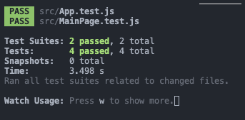

# Sport News App (incomplete)

## I misunderstood the concept of the project so I'm submitting what I have
I apologize for how underdone this is, I was out of commission this weekend but I plan to finish this on my spare time too and practice with Components since it feels like a bit of an achilles heel for me for how best to apply it. 

## The Main Page


## Installation Instructions
1. Fork and clone the repository
2. CD into redesigned-news
3. Run NPM Install to install necessary modules
4. Run NPM start to run the local host (3000)

## Component Snippet
```
//Components
import Articles from "./Articles"
class Blurb extends Component {
    render() {
        return (
            <div className="content is-medium">
                <h2 className="subtitle is-5 has-text-grey">{this.props.date}</h2>
                <h1 className="title has-text-black is-3">{this.props.title}</h1>
                <p className="has-text-dark">{this.props.blurb}</p>
            </div>
        )
    }
}
```

## Data Snippet
This ended up in the Articles.js page because I meant to do it from a seperate page but after speaking with Avery it seemed unneccessary and I haven't been able to revamp it yet
```
const smallArticles = [
    {
        title: "Ultimate Frisbee Champ breaks knee in freak accident",
        summary: "Ultimate Frisbee player falls down elevator shaft. Ongoing investigation to determine if sabotage"
    },
    {
        title: "Player seen flirting with opposing team",
        summary: "Askmore Bepis caught texting with Dinnemus Malcolm in the middle of the game! We were only able to glance the phone from the stands but we suspect they sent 'ASL?'"
    },
    {
        title: "Jillikins Jellyfish retiring early?!",
        summary: "Team Leader Jellyfish quoted that they were retiring early from the sport! Quoted as saying 'Look man midterms are coming up, I don't have time...'"
    },
    {
        title: "Rain delays game",
        summary: "A freak bout of rain has caused delays for the Beestingers versus Kites game that was highly anticipated this weekend"
    }
]
```

## Passed tests


```
test('renders Text tag', () => {
    render(<MainPage />);
    const pElement = screen.getByText(/December 24, 2022/i);
    expect(pElement).toBeInTheDocument();
});
```